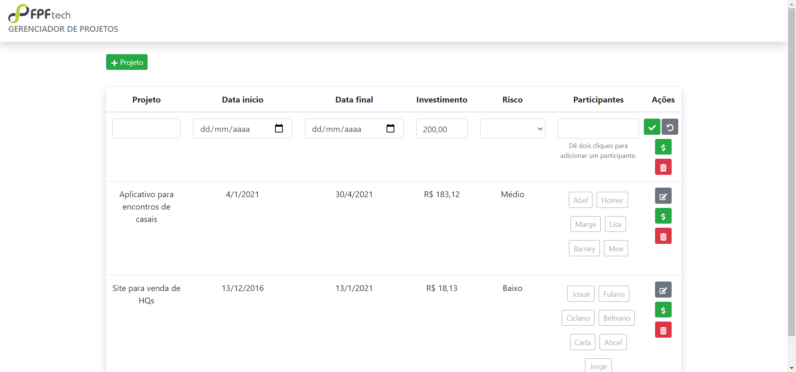
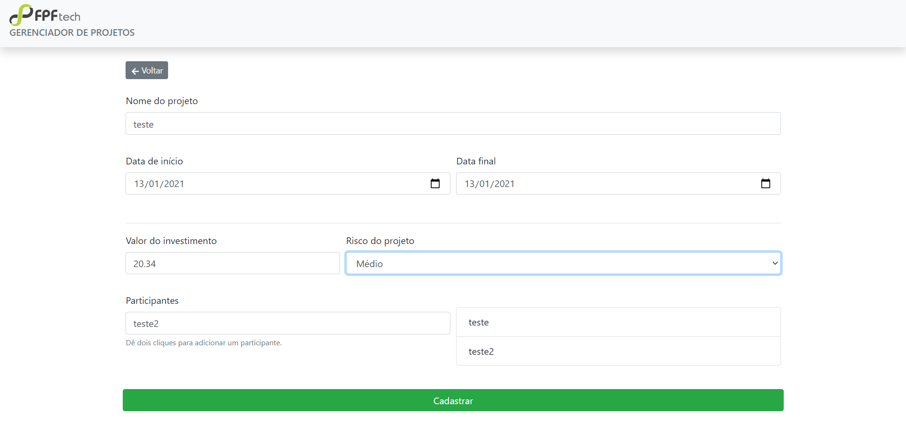
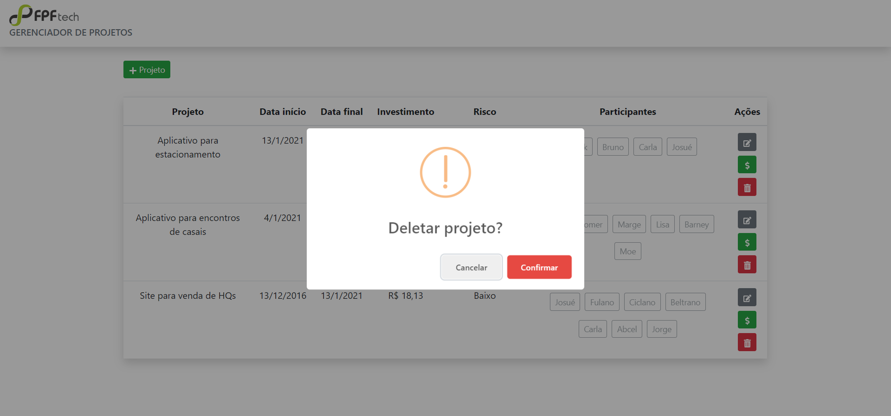
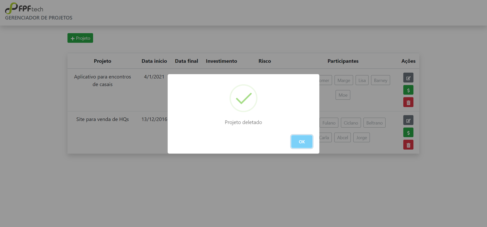
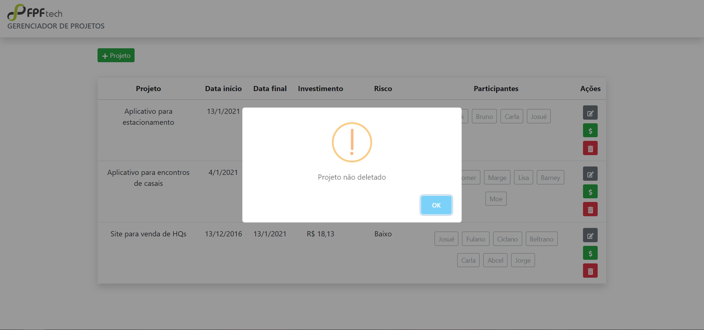
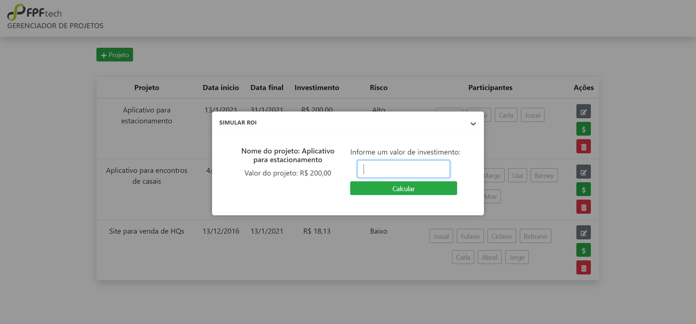
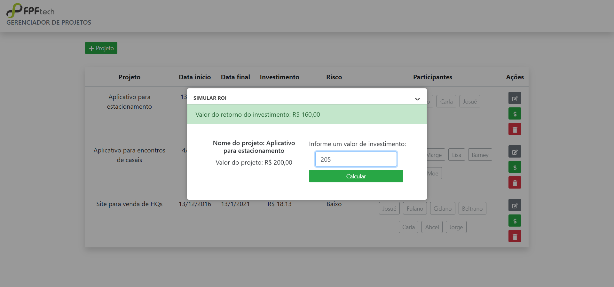
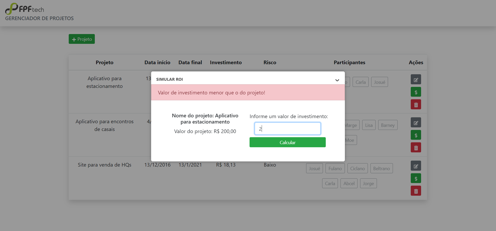

# FPF - Desafio técnico

    Sistema para gerenciar os cadastros de projetos, seu tempo de duração
e realizar uma simulação do cálculo de retorno do investimento.

## Tecnologias utilizadas

 * Nodejs
 * Postgresql
 * Reactjs
 * Knex
 * Bootstrap

## Telas do projeto

### Tela principal

### Tela para cadastro de novos projetos

### Modal para confirmar exclusão do projeto

### Modal pós exclusão do projeto

### Modal de cancelamento do exclusão de projeto

### Modal para simulação do ROI

### Modal para mostrar o valor do ROI

### Modal de erro quando o valor do investimento for menor que a do projeto

### Tela para cadastro de novos projetos